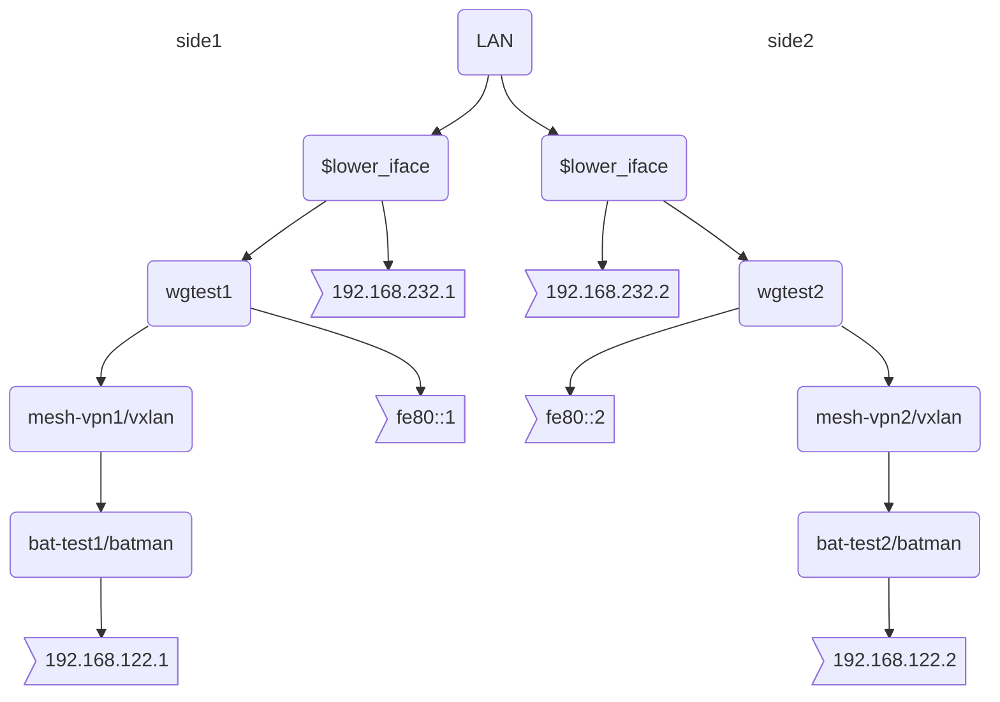

# wg_testenv2.sh

This script supports three modes: `wg`, `wg+vxlan` and `wg+vxlan+batman`.

## `wg`

This sets a wireguard tunnel up, so it can be used.

Just run `./wg_testenv2.sh`:


## `wg+vxlan`

Run `./wg_testenv2.sh vxlan`:


## `wg+vxlan+batman`

Run `./wg_testenv2.sh batman`:




## Performance Testing

You can use the 192.168.122.X ips to do iperf3 on the highest interface level.
```
root@side1 # iperf3 -s 
root@side2 # iperf3 -c 192.168.122.1
```

## Install/Setup

Programs:
- `apt install batctl`
- `apt install wireguard`
- open 4750/udp for vxlan in your ipv6 firewall.
- open wg_testenv2.sh and adjust the variables `lower_iface=...` and `side=X` to your needs.
- run `./wg_testenv2.sh ...`

You can always cleanup with:
- `wg_testenv2.sh cleanup`

## Debugging

### Tcpdump

```
root@side1 # tcpdump -n -i wgtest1
root@side1 # tcpdump -n -i mesh-vpn1
root@side1 # tcpdump -n -i bat-test1
root@side2 # tcpdump -n -i wgtest2
root@side2 # tcpdump -n -i mesh-vpn2
root@side2 # tcpdump -n -i bat-test2
```

### Batman

Observe the TQ of the batman neighbors:

```
root@side1 # sudo batctl -m bat-test1 o
Warning - option -m was deprecated and will be removed in the future
[B.A.T.M.A.N. adv 2022.3, MainIF/MAC: mesh-vpn1/be:e6:02:f7:76:dc (bat-test1/46:44:a0:1a:45:13 BATMAN_IV)]
    Originator        last-seen (#/255) Nexthop           [outgoingIF]
  * 76:ac:92:89:9f:57    0.340s   (147) 76:ac:92:89:9f:57 [ mesh-vpn1]
```